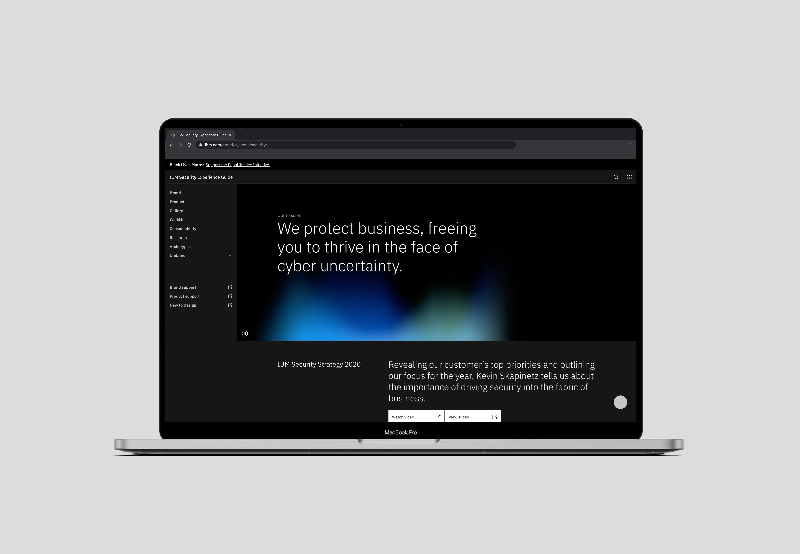
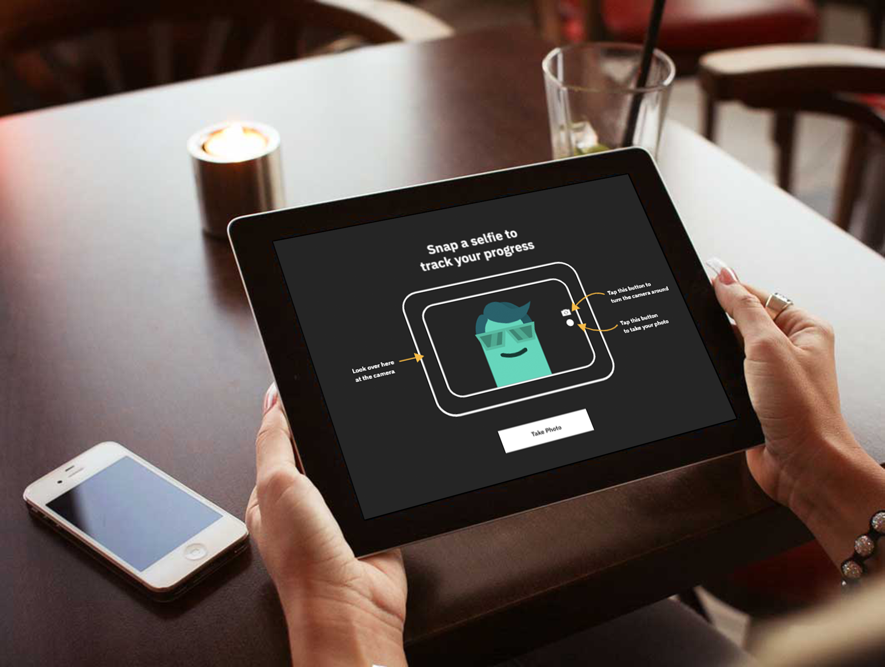

import { Card } from '../../components/Card';
import { Layout } from '../../components/Layout';

<Layout title="Work">

<Card
  description="Open source React pattern and asset library for IBM Security"
  href="https://github.com/carbon-design-system/ibm-security"
  title="Carbon for IBM Security"
>

</Card>

<Card
  description="GatsbyJS website for essential guidelines when working within or on behalf of IBM Security"
  href="https://www.ibm.com/brand/systems/security"
  title="IBM Security Experience Guide"
>

</Card>

<Card
  description="Interactive research study examining animation principles against scores for perceived loading times and overall satisfaction"
  href="https://github.com/simonfinney/research-project"
  title="Perceived loading time of animation"
>

</Card>

<Card
  description="SXSW 2017 data privacy augmented reality project"
  href="https://newsroom.ibm.com/2017-03-10-IBM-SXSW-Experience-How-IBM-is-Making-with-Watson-at-the-IBM-Makers-Garage-at-SXSW-March-10-14"
  title="See How Much You’re Exposing"
>

</Card>

</Layout>
