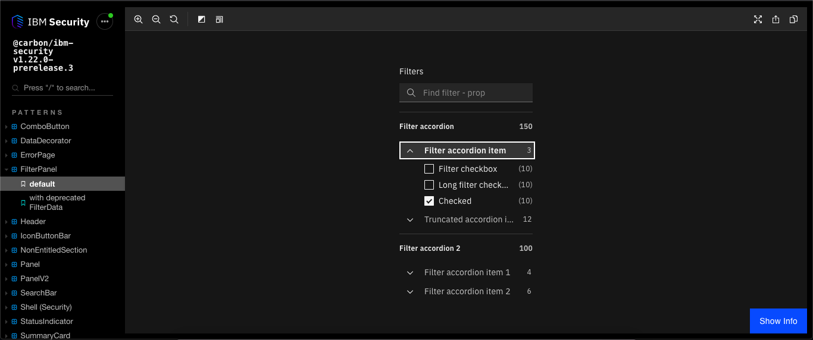
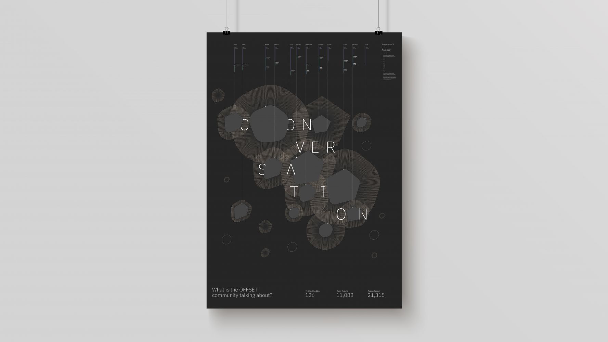

### Carbon for IBM Security

Open-source React and SCSS pattern and asset library built for IBM Security, leveraging the Carbon Design System and IBM Design Language as its foundation.

- [GitHub](https://github.com/carbon-design-system/ibm-security/)
- [Storybook](https://ibm-security.carbondesignsystem.com)

### IBM Security Experience Guide

JAMstack website providing essential guidelines for anyone working within or on behalf of IBM Security.

### ID2015 — Design Island

Hybrid mobile application developed in conjunction with the Design & Crafts Council Ireland aimed at helping people navigate and discover a myriad of design delights across Ireland.

[Irish Design 2015 - ID2015 - Design Island: New app to help visitors experience the best of Irish design](http://www.irishdesign2015.ie/news/single/design-island-new-app-to-help-visitors-experience-the-best-of-irish-design/press)

### See How Much You're Exposing

Interactive data privacy augmented reality experience showcased at OFFSET Dublin 2018.

- [Application](https://offset.mybluemix.net/)
- [Display](https://offset.mybluemix.net/receive)

### Watson Conversation Poster

Data visualisation poster leveraging a data set derived from 11,000 tweets from the OFFSET Dublin 2018 design community and analysed using IBM Watson's natural language understanding to determine and score the emotion behind the language used in the tweet's topic.

[Watson Conversation Poster — 100 Archive](http://www.100archive.com/project/conversation)

